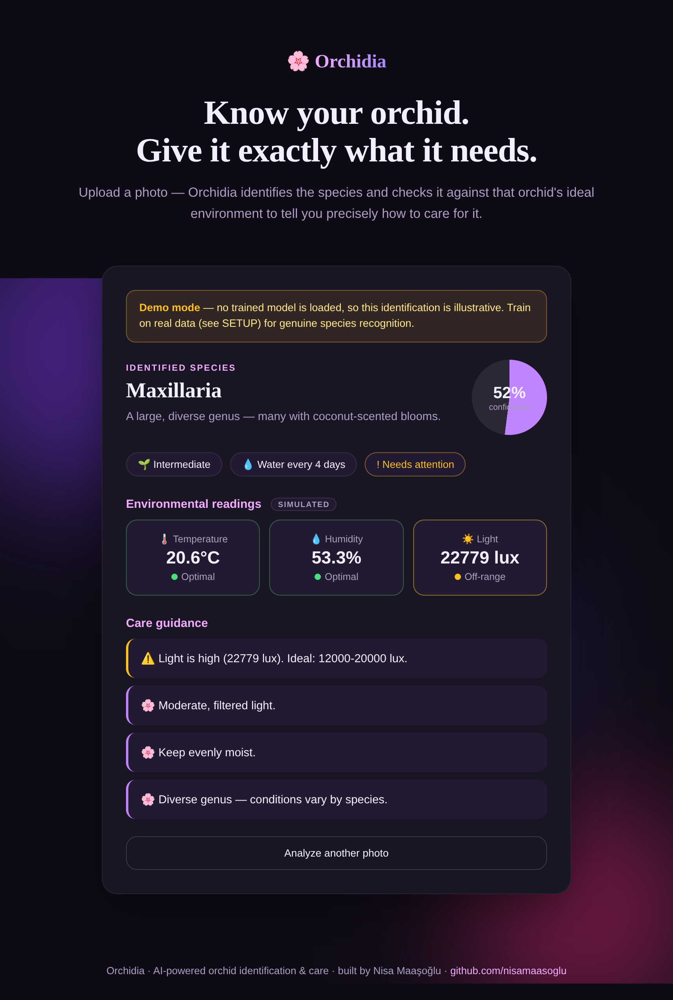

<h1 align="center">🌸 Orchidia</h1>
<p align="center"><b>AI-powered orchid identification & care assistant</b></p>
<p align="center">Upload a photo — Orchidia recognises the orchid species and checks it against that species' ideal environment to tell you exactly how to care for your plant.</p>

<p align="center">
  
  
  
  
</p>

<p align="center"><b>Version 1.0 · Completed</b></p>

---

## 🌿 Overview

Orchids are as rewarding as they are demanding — each species needs different light, humidity, and watering. **Orchidia** removes the guesswork:

1. 📷 **Identify** — a deep-learning model recognises the orchid species from a photo.
2. 🌡️ **Evaluate** — the app checks environmental readings (temperature, humidity, light) against that species' ideal ranges.
3. 💡 **Advise** — a care engine turns the result into clear, actionable guidance and alerts.

Designed to train on the [20-species orchid dataset](https://www.kaggle.com/datasets/mikful/orchids).

## 📸 Screenshots

<p align="center">
  
  
</p>

## ✨ Features

- **Species identification** — a MobileNetV2 transfer-learning model, trained on the orchid dataset.
- **Top-3 predictions** with confidence scoring.
- **Environmental evaluation** — temperature, humidity, and light checked against species-specific optimal ranges.
- **Smart care alerts** — instant warnings when a reading drifts out of range, with an overall health status.
- **Care library** for 20 orchid genera — difficulty, watering cadence, and expert tips.
- **Runs out of the box** — starts in a clearly-labelled demo mode with no trained model, so the full UI is explorable immediately.
- **Modern, responsive web UI** — drag-and-drop upload and animated results.

> **Note on readings.** Environmental values are **simulated** in `app.py` (see
> [Connecting real sensors](#-connecting-real-sensors)). The evaluation logic is real;
> only the input source is stubbed, so swapping in real hardware needs no other changes.

## 🧠 How it works

Orchidia uses **transfer learning** — a pretrained **MobileNetV2** network fine-tuned on
orchid photos — to classify the species. The prediction feeds a rule-based **care engine**
that compares each environmental reading against the species' ideal range and produces a
health status, warnings, and tips.

Two design choices keep it robust:

- **Lightweight fallback.** If TensorFlow isn't installed, training and inference fall back
  to a scikit-learn model over hand-crafted colour/texture features — no GPU required.
- **Demo mode.** With no trained model on disk, the app serves a deterministic,
  clearly-labelled demo prediction so it always starts. Train on real data for genuine
  recognition.

## 🛠️ Tech Stack

`Python` · `TensorFlow (MobileNetV2)` · `Flask` · `scikit-learn` · `NumPy` · `Pillow` · `HTML/CSS/JS`

## 🚀 Quick Start

```bash
pip install -r requirements.txt
python app.py                 # http://localhost:5000
```

The app starts immediately in **demo mode**. For real identification, train a model first:

```bash
pip install tensorflow        # optional, for the deep model
python train.py --data dataset
python app.py
```

See **[SETUP.md](SETUP.md)** for full dataset and training instructions.

## 🧪 Running the tests

```bash
pip install -r requirements-dev.txt
pytest -q
```

The suite (13 tests) covers the care engine, the knowledge base, feature extraction, the
classifier's demo mode, and the `/analyze` API end to end. It runs without TensorFlow or the
dataset, and is checked on Python 3.10–3.12 in CI (`.github/workflows/ci.yml`).

## 📁 Project Structure

```
Orchidia/
├── app.py                 # Flask web application
├── train.py               # Trains the model on a real dataset
├── core/
│   ├── features.py        # Image feature extraction (fallback model)
│   ├── classifier.py      # Deep / lightweight / demo backends
│   ├── care_engine.py     # Environmental evaluation & care logic
│   └── orchid_data.py     # Care knowledge base (20 genera)
├── templates/ · static/   # Web UI
├── tests/                 # Test suite
├── SETUP.md               # Step-by-step setup
└── requirements.txt
```

## 🔌 Connecting real sensors

`app.py` produces environmental readings via `simulate_sensors()`. To use real hardware,
replace that function with input from your sensors (e.g. an Arduino over serial or an MQTT
feed) — the care engine works unchanged.

---

<p align="center">Built by <b>Nisa Maaşoğlu</b>, Software Engineer · <a href="https://github.com/nisamaasoglu">github.com/nisamaasoglu</a></p>
<p align="center"><i>Licensed under the MIT License.</i></p>
